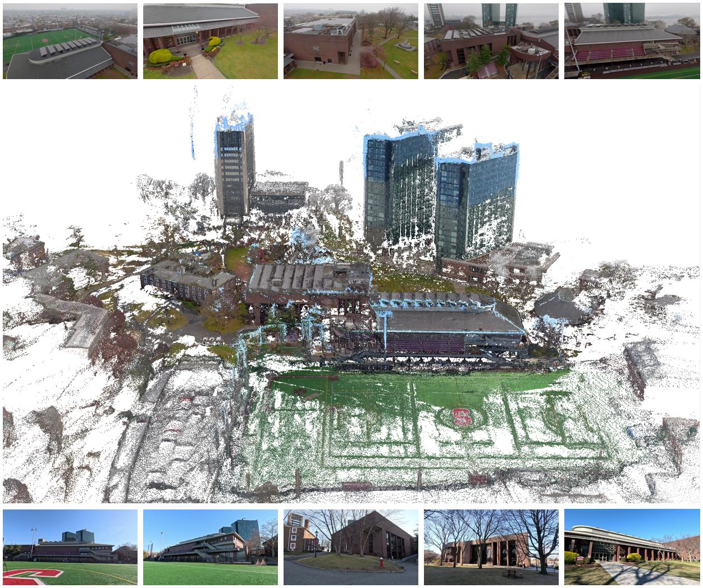
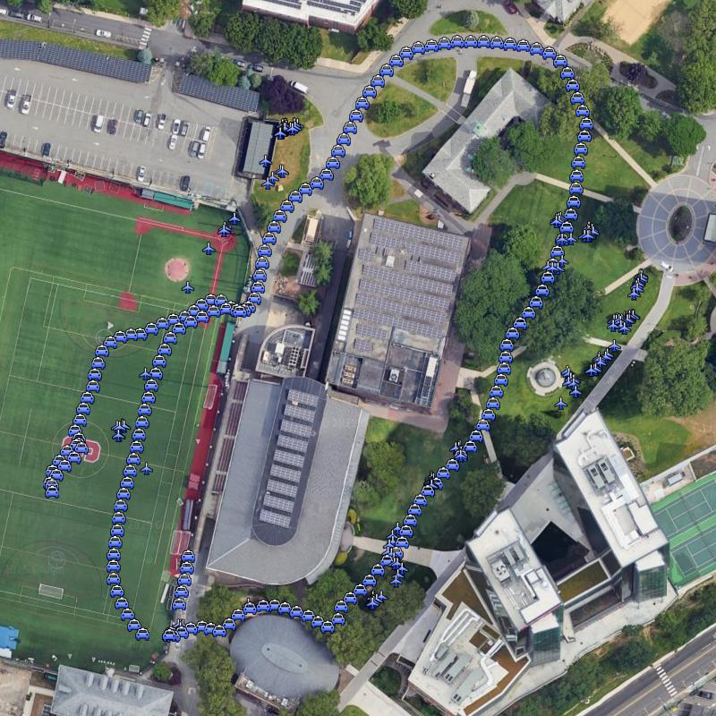
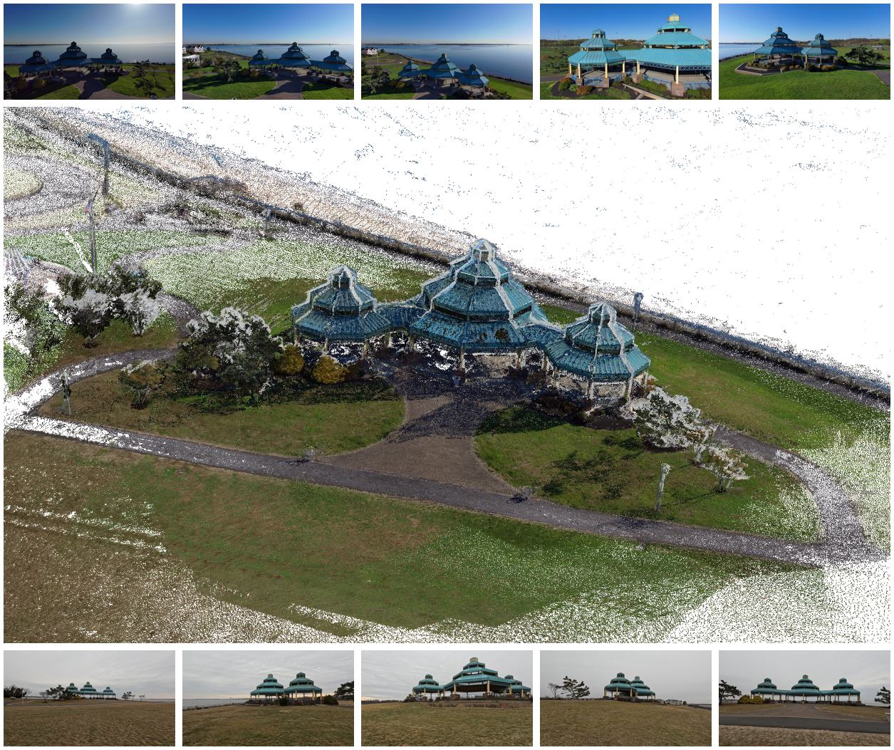
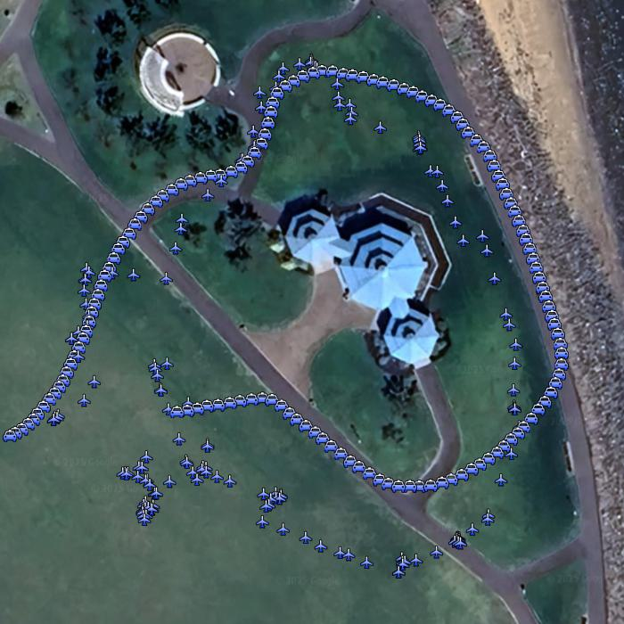

## CVD-SfM

CVD-SfM is a Cross-View Deep Front-end Structure-from-Motion System for Sparse Localization in Multi-Altitude Scenes.

## Custom-Gathered Datasets
### Stevens Institute of Technology Campus
<p align="left">
  
  
</p>

### Raritan Bay Waterfront Park
<p align="center">
  
  
</p>

```
└── {DATASET_NAME}
       ├── images
               ├── image1.jpg
               ├── image2.jpg
               ├── image3.jpg
```  

## Citing this work
