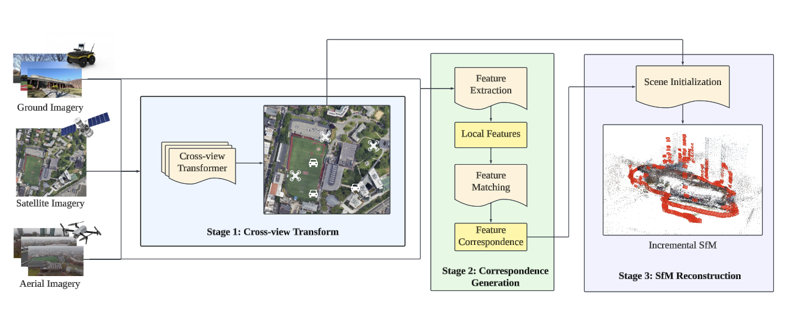
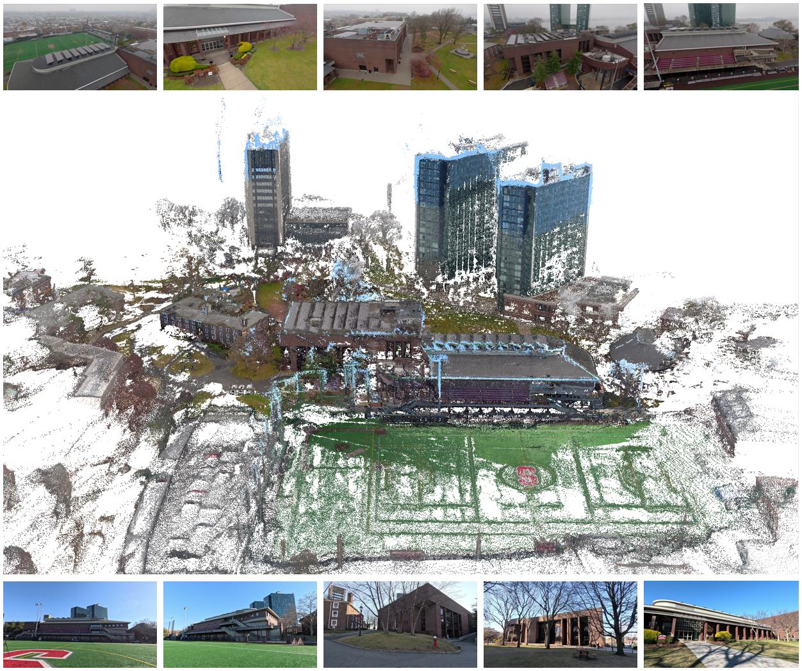
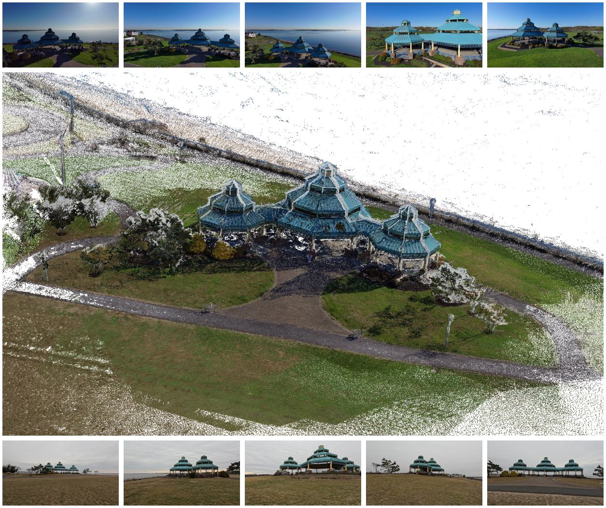
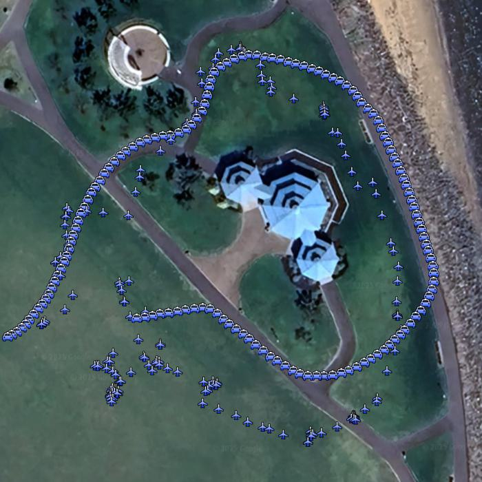

## CVD-SfM

This repository provides the code implementation of our **IROS 2025** paer. We developed a Cross-View Deep Front-end Structure-from-Motion System for Sparse Localization in Multi-Altitude Scenes. The performance of our approach is shown in the video. 

<p align="left">
  
</p>

We also create 2 multi-altitude datasets with ground truth GPS for two different sites. Each contains aerial imagery collected by UAV and ground imagery collected by handheld device. One high-resolution satellite imagery from Google Earth Pro is also included for each site. Ground-level GPS is achieved by RTK GNSS using EMLID Reach RS+ receivers. You can get the dataset on hugging face: https://huggingface.co/datasets/yaxlee/Stevens-Sky2Ground.

If you find this repository useful, please cite our paper:

## Installation
Our implementaion is on Ubuntu20.04, python=3.11.5, torch=2.0.0, torchvision=0.15.1.
### COLMAP
```
git clone https://github.com/RobustFieldAutonomyLab/CVD-SfM.git
cd CVD-SfM/colmap
mkdir build && cd build
cmake .. \
  -DCMAKE_BUILD_TYPE=Release \
make -j$(nproc)
sudo make install
```

### Dependence
```
pip install -r requirements.txt
```
## Run Instruction
```
python run_cvd_sfm.py
```
Remeber to change the root dir to your own path and make sure /images and /sat dir are included in root dir.
```
└── Root Dir
      ├── images
               ├── image1
               ├── image2
               ├── ..
      ├──sat
               ├── satellite image
```

## Custom-Gathered Dataset: Stevens-Sky2Ground
We collect two multi-altitude datasets with ground truth GPS for two different sites. Each contains aerial imagery collected by UAV and ground imagery collected by handheld device. One high-resolution satellite imagery from Google Earth Pro is also included for each site. Ground-level GPS is achieved by RTK GNSS using EMLID Reach RS+ receivers.
### Stevens Institute of Technology Campus
<p align="left">
  
  
</p>

This dataset contains 179 aerial images, 186 ground images and 1 satellite image.

### Raritan Bay Waterfront Park
<p align="left">
  
  
</p>

This dataset contains 174 aerial images, 139 ground images and 1 satellite image.

Datasets Structure:
```
└── SIT campus
       ├── images
               ├── aerial_image1.png
               ├── aerial_image2.png
               ├── ..
               ├── ground_image1.png
               ├── ground_image2.png
               ├── ...
      ├── gps
               ├── aerial_image1.json
               ├── aerial_image2.json
               ├── ...
               ├── ground_image1.json
               ├── ground_image2.json
               ├── ...
      ├── satellite_sit.jpg
      ├── trajectory.jpg
└── Raritan bay
       ├── ...
```

Our dataset is available on hugging face: https://huggingface.co/datasets/yaxlee/Stevens-Sky2Ground
